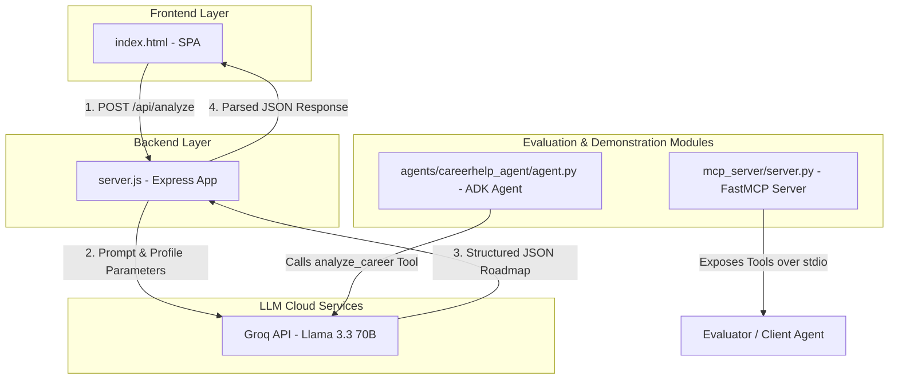

# CareerHelp AI – Career Navigation & Opportunity Agent

CareerHelp AI is an AI-powered career navigation web application designed to help users identify optimal technology career paths matching their skills and interests, analyze gaps, recommend certifications/learning resources, and outline a structured, phase-by-phase roadmap.


[**Live Link** ](https://careerhelp-ai-production.up.railway.app/ )


---

## Tech Stack

The project comprises three primary modules built with modern frameworks:

### 1. Production Web Application (Node.js & Express)
* **Frontend**: Responsive Single-Page Application (SPA) built using HTML5, CSS Variables, TailwindCSS, and custom glassmorphism components. It integrates modern typography from Google Fonts (Space Grotesk for headings, JetBrains Mono for metrics).
* **Backend**: Node.js & Express server handling static asset hosting and proxying requests securely to Groq API.
* **Large Language Model**: **Llama 3.3 70B (llama-3.3-70b-versatile)** via Groq, configured to output strictly structured JSON roadmaps.

### 2. Standalone Conversational Agent (Google ADK)
* **Framework**: Google Agent Development Kit 2.3.0 (`google-adk`).
* **LLM Client Wrapper**: LiteLLM utilizing the Groq model provider.
* **Capabilities**: Exposes the `analyze_career` method as a registered agent tool to run career analyses conversationally in the agent runtime.

### 3. Model Context Protocol Server (MCP)
* **Framework**: Python MCP SDK (`mcp` package with `FastMCP` decorator utility).
* **Capabilities**: Exposes two mock data search tools over MCP standard input/output transport:
  1. `search_courses(skill)`: Recommends curated online courses.
  2. `internship_platforms(domain)`: Suggests target portals for internships.

---

## Folder Structure

```text
CareerHelpAI/
├── server.js                        # Node.js backend entrypoint
├── index.html                       # Frontend Single-Page Application
├── package.json                     # Node dependency manifest
├── package-lock.json                # Locked Node dependencies
├── .env                             # Environment configuration (e.g. GROQ_API_KEY)
├── .gitignore                       # Ignored version control paths
│
├── agents/                          # Standalone Google ADK Agent
│   ├── requirements.txt             # Python dependencies (google-adk, etc.)
│   ├── .env                         # Agent credentials file
│   └── careerhelp_agent/
│       ├── __init__.py              # Package initialization
│       └── agent.py                 # ADK Agent definition and tool logic
│
└── mcp_server/                      # FastMCP Capstone Server Demo
    ├── requirements.txt             # Python dependencies (mcp, etc.)
    └── server.py                    # FastMCP Server definition and tool definitions
```

---

## System Architecture

The following diagram illustrates how the Express Web App, ADK Agent, and MCP Server components relate:



---

## Setup & Running Instructions

Ensure you have **Node.js** (v18+) and **Python** (v3.10+) installed.

### 1. Setting Up Credentials
Create a `.env` file in the project root directory and add your Groq API credentials:
```env
GROQ_API_KEY=gsk_your_actual_groq_api_key_here
```

### 2. Running the Express Web App
1. Open a terminal in the project root directory.
2. Install the Node packages:
   ```bash
   npm install
   ```
3. Start the Express server:
   ```bash
   node server.js
   ```
4. Access the web app in your browser at: [http://localhost:3000](http://localhost:3000).

### 3. Running the Standalone ADK Agent
1. Navigate into the `agents` folder:
   ```bash
   cd agents
   ```
2. Create a `.env` file inside the `agents` directory containing your `GROQ_API_KEY`.
3. Install the ADK dependencies:
   ```bash
   pip install -r requirements.txt
   ```
4. Run the agent using the ADK CLI:
   * To test conversationally in terminal:
     ```bash
     adk run careerhelp_agent
     ```
   * To run the ADK local web playground interface:
     ```bash
     adk web
     ```

### 4. Running the MCP Server
1. Navigate into the `mcp_server` folder:
   ```bash
   cd mcp_server
   ```
2. Install the FastMCP dependencies:
   ```bash
   pip install -r requirements.txt
   ```
3. Run the MCP server over standard input/output streams:
   ```bash
   python server.py
   ```
4. The server can be integrated with MCP client host applications (like Claude Desktop or cursor editors) by configuring it as a command execution:
   ```json
   {
     "mcpServers": {
       "careerhelp-mcp": {
         "command": "python",
         "args": ["path/to/mcp_server/server.py"]
       }
     }
   }
   ```
